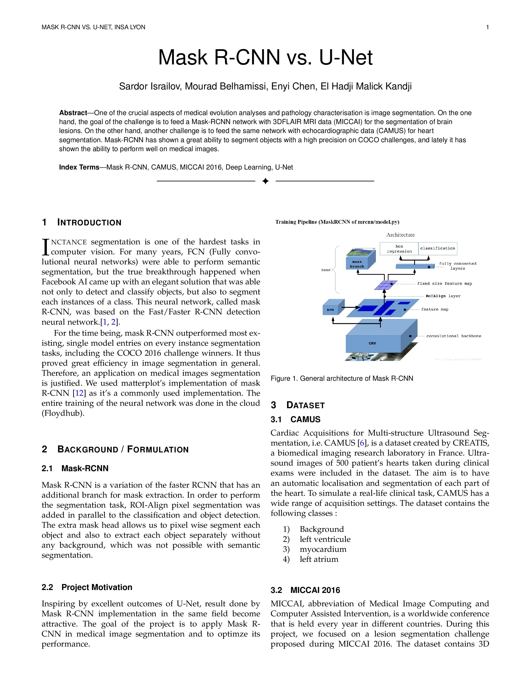
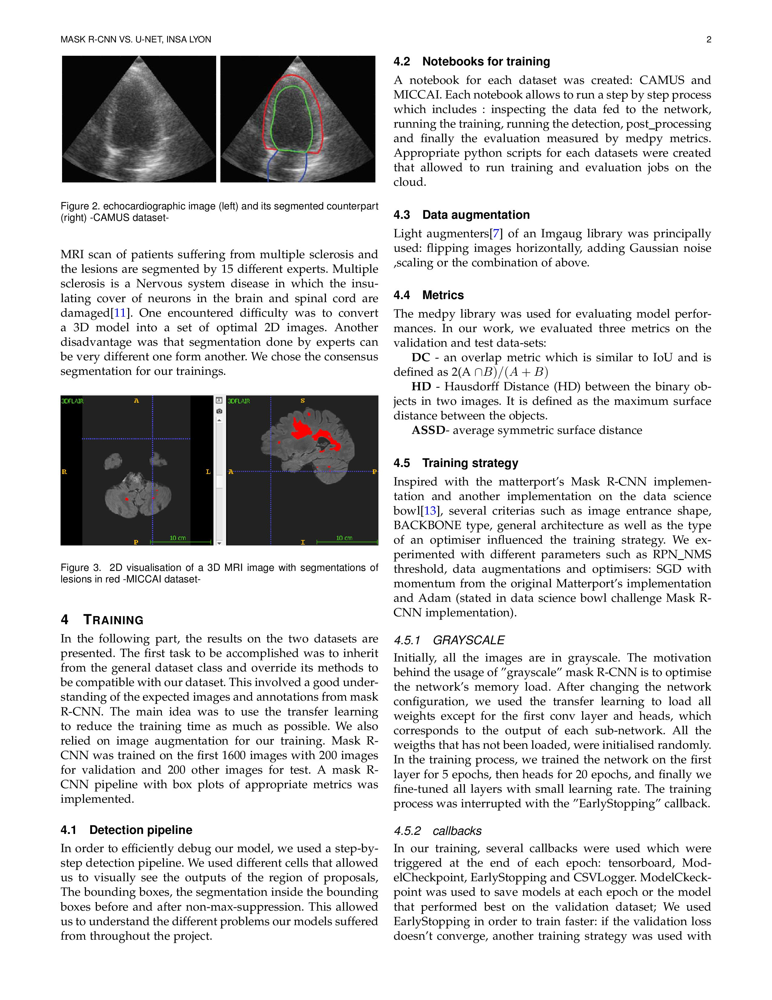
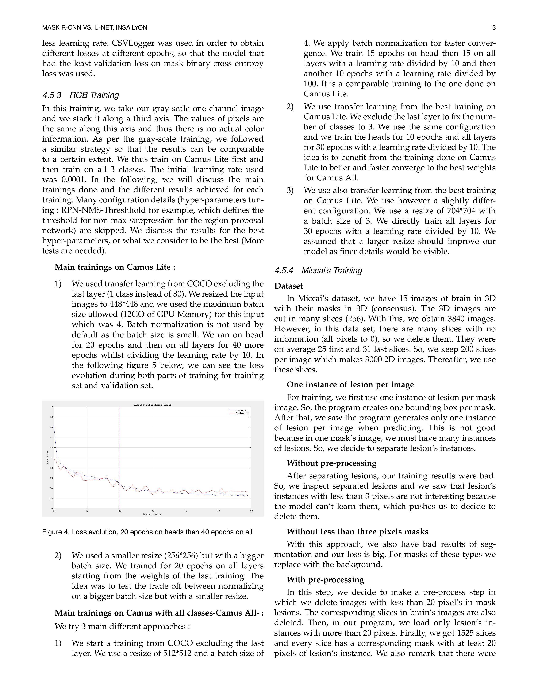
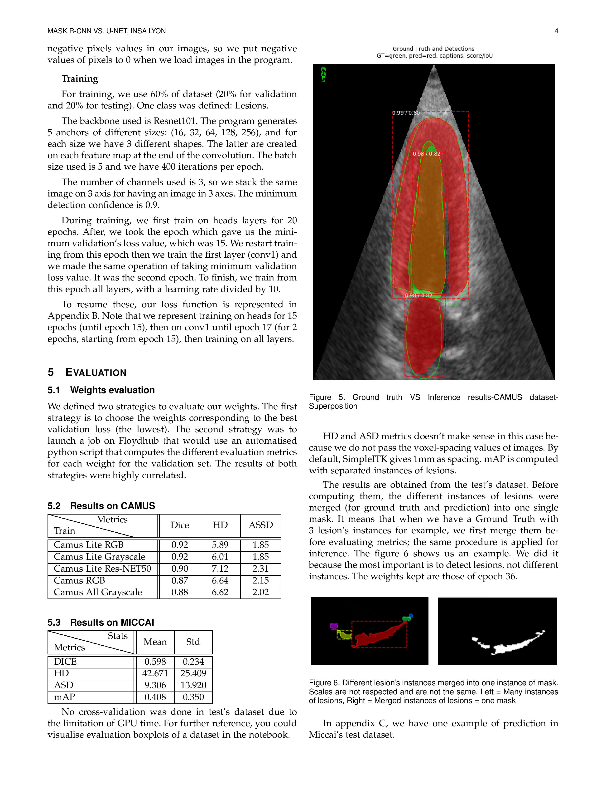
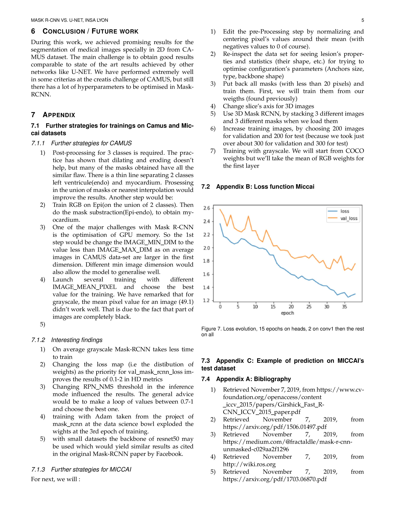
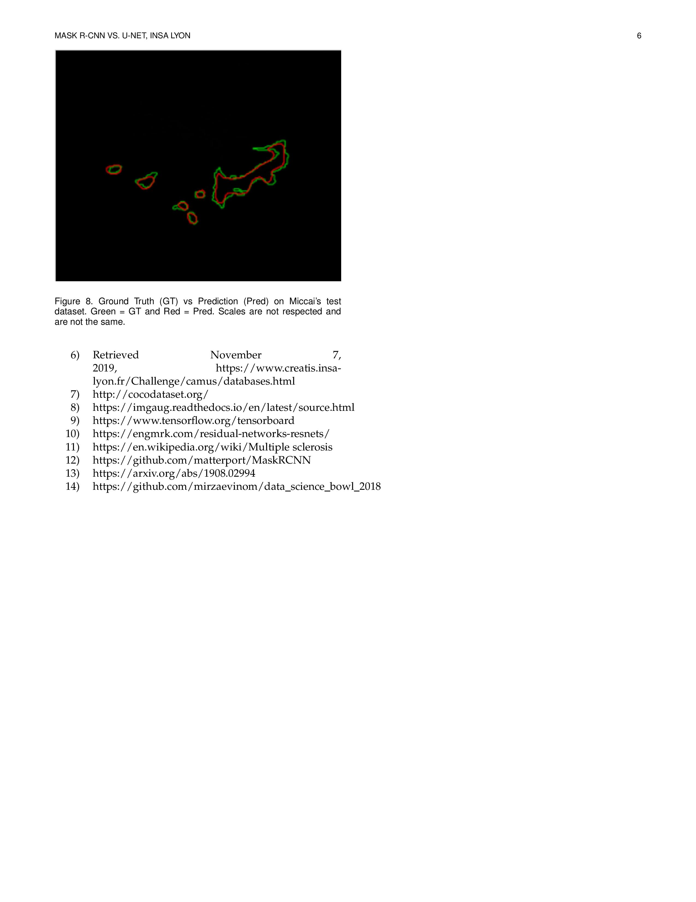

# MEDICAL_SEGMENTATION_VISION_MRCNN
Final year MS mask r-cnn & u-net computer vision project for automatic heart detection of IRM images developed by CREATIS, France

-Notebook for CAMUS dataset RGB segmentation

-Notebook for CAMUS dataset Grayscale image segmentaiton approach

-Notebook for Miccai 216 3d IRM segmentation

Group work: ISRAILOV, Belhamissi, Kandji, Chen.

